# 🚗 PillarAMF: Towards Efficient Pillar-based 3D Object Detection via Adaptive Multi-scale Feature Fusion

---

## 🧠 Architecture Overview

  

---

## 🚀 Get Started

### 🔧 Installation

Set up your environment by following the guide in:  
📄 [**INSTALL.md**](docs/INSTALL.md)

### 📁 Data Preparation

Prepare the dataset as described in:  
📄 [**DATA.md**](docs/DATA.md)

### 🏃‍♀️ Training & Evaluation

Train and evaluate models by following:  
📄 [**RUN.md**](docs/RUN.md)

---

## 📊 Main Results

### 📍 nuScenes Validation Set

| Model               | mAP (%)  | NDS (%)  | Checkpoints |
|--------------------|------|------|-------------|
| **PillarAMF-Small** | 59.6 | 66.1 | [Google Drive](https://drive.google.com/file/d/1EGbp_66L4QrQ_PyUoij8k2DPZFfGq55Y/view?usp=sharing) / [Baidu (pwd: `9n4g`)](https://pan.baidu.com/s/1FsZfAeVthJDsNIT7ln4llA?pwd=9n4g) |
| **PillarAMF-Base**  | 64.0 | 69.6 | [Google Drive](https://drive.google.com/file/d/13qzvi8NZdFSr6qLpG3g-vU44OAHphlTI/view?usp=sharing) / [Baidu (pwd: `b94h`)](https://pan.baidu.com/s/1pV0E--H84Np8kkEAlCf2sw?pwd=b94h) |
| **PillarAMF-Large** | 64.5 | 70.1 | [Google Drive](https://drive.google.com/file/d/1kmst9vy2CmdXoa3sVscAPilqKBUgjtjS/view?usp=sharing) / [Baidu (pwd: `hm22`)](https://pan.baidu.com/s/1nklRQzwW7pHwPxGSHxqkRQ?pwd=hm22) |

---

## 🙏 Acknowledgements

We gratefully acknowledge the contributions of the following open-source projects:

- [Det3D](https://github.com/poodarchu/Det3D)  
- [CenterPoint](https://github.com/tianweiy/CenterPoint)  
- [OpenPCDet](https://github.com/open-mmlab/OpenPCDet)  
- [PillarNeXt](https://github.com/qcraftai/pillarnext)  
- [ConvNeXt-V2](https://github.com/facebookresearch/ConvNeXt-V2)  

---

## 📄 License

This project is licensed under the **MIT License**.  
See the [LICENSE](LICENSE) file for details.

---

📌 For bug reports, questions, or contributions, feel free to open an issue or submit a pull request.
